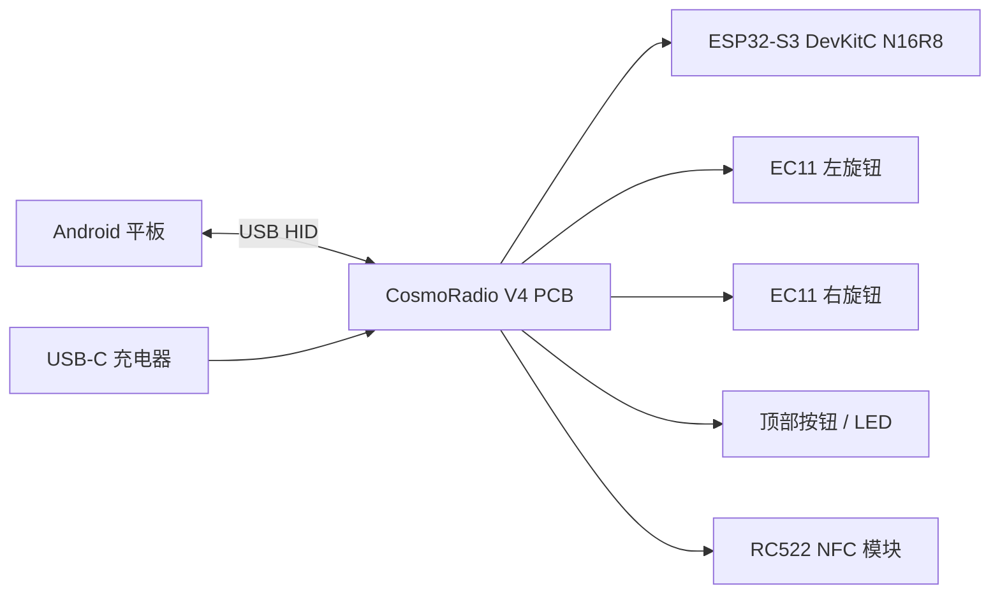
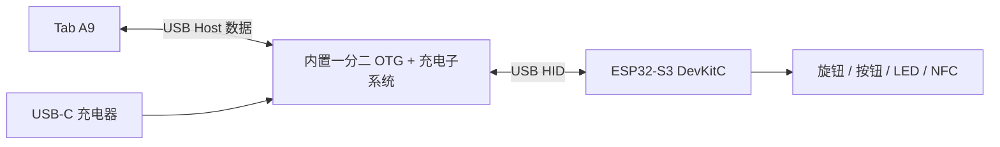
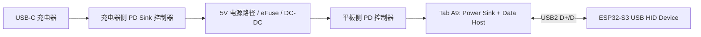
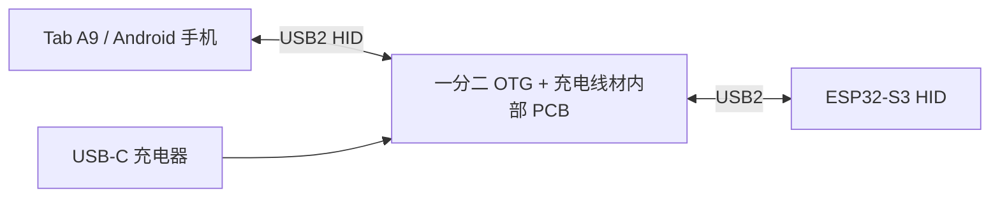
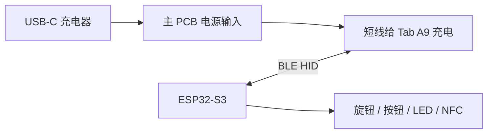
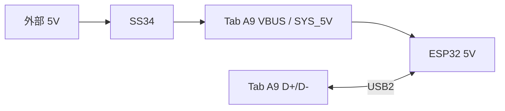
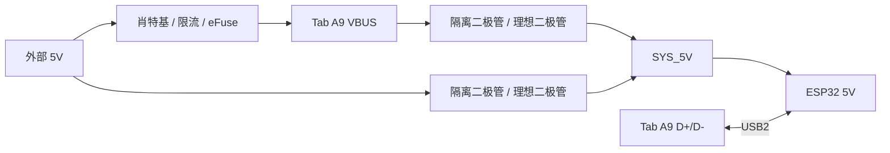

# CosmoRadio V4 PCB

> **状态 (2026-05-22)**：**PCB r1.0 已打样 + 实焊 + 固件验证通过**。实际投产用的是 JLCEDA Pro 的手绘版（源文件 `~/Downloads/P1.epro2`），不是本仓库里的 KiCad `cosmoradio-v4-carrier/`（那是 Plan v2 的备选方案，未使用，保留作历史参考）。
> 已知 PCB r1.0 issue: J4 (EC11-R) 引脚顺序跟 J3 (EC11-L) 镜像导致右旋钮线序错位，固件已 walkaround（见 CLAUDE.md "PCB r1.0 EC11-R 接线 walkaround"），硬件无需返工。PCB r1.1 计划把 J4 改回对称。

CosmoRadio V4 的 PCB 目标是做一块 ESP32-S3 DevKitC N16R8 载板，用于技术方案验证和单套原型制作。

当前阶段不追求量产最优，而是追求：

- 可快速打样
- 可手工装配
- 可稳定验证 USB HID、外部充电、旋钮、按钮、NFC
- 出问题时容易测量和返修

## 当前范围

| 项目 | 结论 |
|------|------|
| 合作状态 | 2026-04-29 与 Arthur 重启 V4 |
| 当前交付 | 技术方案验证 + 单套原型制作 |
| 合同价 | ¥5,000 |
| 目标时间 | 2026-05-20 左右 |
| 核心风险 | PCB 设计与验证 |
| 非当前目标 | 原 4 套整机 + 8 套电子件批量交付 |

## 2026-05-07 整体方案验证完成 ✅

| 项目 | 状态 |
|------|------|
| NFC 数量 | ✅ 确认 **1 个** RC522 mini |
| 一分二 OTG + 充电线材 | ✅ 已采购多种型号，测试出一种比较理想，作为内置子板基准 |
| 手工万能板原型 | ✅ 已焊出（[图片](../docs/assets/v4-handmade-prototype-2026-05-06.jpg)）：ESP32-S3 DevKitC + 拆解后的一分二小板 + 4 路 XH2.54 连接器 |
| 测试机 | ⚠️ 原 R4 Tab A9 已损坏，临时用安卓手机替代验证；新 Tab A9 到货后需回归 |
| 连接器布局 (PCB r1.0) | 顶部 J5 USB 4P / 左前 J1 BTN 2P / 左中 J3 EC11-L 5P / 右中 J4 EC11-R 5P / 右底 J2 NFC 8P |
| GPIO 分配 | ✅ V4 终版定稿（2026-05-06），详见 [CLAUDE.md](../CLAUDE.md) |
| 外接 LED | ❌ 不接（用 DevKitC 板载 GPIO48 RGB LED 做调试） |
| EC11 接线 | 3 IO + 共地（C 与 SW2 都接 GND，无需 VCC，靠 ESP32 内部上拉） |
| 固件 V4 GPIO 迁移 | ✅ 完成（2026-05-06）；V3 SuperMini pinout 完全弃用 |
| RC522 NFC 驱动 | ✅ 1MHz SPI，NDEF Text Record 解析跑通（2026-05-07） |
| HID 协议 | ✅ `#<payload>\n` 主路径 + `NFC:<UID>\n` 兜底（2026-05-07） |
| 端到端验证 | ✅ iPhone 写卡 "112358" → ESP32 读 NDEF → HID 键入 `#112358\n`（2026-05-07） |

**剩余工作集中在 PCB 设计 + 结构件**——所有方案级未知都已收敛。

## PCB 落版（r1.0，2026-05-22 实焊验证）

> Plan v2 (KiCad) 方案保留在 `cosmoradio-v4-carrier/` 作历史参考；实际打的是 JLCEDA Pro 手绘的 P1.epro2，连接器编号跟 Plan v2 不同（详见 CLAUDE.md "GPIO Pin Assignments"）。

- 万能板飞线版 1:1 复制（连接器位置、网络名都已经在飞线上验证过）
- ESP32-S3 DevKitC N16R8 用**两条 1×22 单排母**（不是 2×22 双排，单排好焊好对齐），间距 22.86mm
- **5 路 XH2.54 连接器**（PCB r1.0 编号：J1 BTN 2P / J2 NFC 8P / J3 EC11-L 5P / J4 EC11-R 5P / J5 OTG USB 4P）
- OTG dongle (YK16-09E V1) 拆 USB-A 母座后 4 飞线焊到 J5 公头线
- **EC11 A/B 信号外加 10kΩ + 10nF RC 去抖**（4 R + 4 C，全 0805 贴片）—— 解决飞线版"一格不准"
- NFC SPI 时钟可尝试拉回 5MHz（铜箔走线 + 模块自带去耦应该够）
- 板尺寸 **100×100mm 双面板**（JLC 免费打样上限），无 USB-C 母座、无 SS34、无外接 LED
- ⚠ **r1.0 已知 issue**：J4 (EC11-R) 引脚顺序画成跟 J3 镜像，导致 EC11 端子线序错位。固件已 walkaround；r1.1 应把 J4 改成跟 J3 对称的 `[A, GND, B, GND, SW]`

## 板子定位

这不是完整 ESP32 主控板，而是 **ESP32-S3 DevKitC N16R8 carrier board**。

ESP32-S3 DevKitC 通过 2.54mm 排母插在 PCB 上，PCB 只负责：

- 固定主控与外设线束
- 消灭 V3 的万能板和飞线
- 将旋钮、按钮、LED、NFC、USB-C 接口标准化
- 提供必要的上拉、电阻、二极管、去耦
- 支持单套原型的调试和返修

## 已确认事实

### 主控

- 使用 ESP32-S3 DevKitC N16R8，不再使用 V3 的 ESP32-S3 SuperMini。
- DevKitC 插在载板上，不直接焊死。
- ESP32-S3 原生 USB OTG 固定使用 GPIO19 / GPIO20。
- 当前固件仍是 V3/SuperMini pinout，后续必须迁移到 V4 pinout。

### 输入与输出

- 两个 EC11 旋钮，每个旋钮有 A / B / SW。
- Action Button 使用 Kailh BOX 轴 + 6.25U 卫星轴，本质是单路低电平按钮。
- LED 使用 WS2812B，数据线串 330R。
- NFC 使用 RC522 mini 模块，通过 SPI 连接，不把 MFRC522 芯片集成到主板。

### USB 与供电

- 平板是 Samsung Galaxy Tab A9 8.7"。
- 平板侧需要同时承担 USB Host 和充电需求。
- HID 必须走有线 USB；BLE HID 之前已经测试过，不稳定，排除出当前主路径。
- V3 已经通过 Type-C 一分二 OTG 线材验证：Tab A9/Android 手机可以同时接收 ESP32 USB HID 输入并充电。
- 当前问题不是“原理是否成立”，而是 V3 的一分二线材太长、外露、形态差。
- V4 目标是尽可能把一分二线材里的 OTG + 充电能力集成到 PCB/内部结构中，减少外露线材。
- 市面上容易买到的是 OTG + 充电转接线/小扩展坞，不是适合直接嵌入主 PCB 的裸模块。

当前 USB/充电路径按三档处理：

| 档位 | 方案 | 当前定位 |
|------|------|----------|
| P0 | 外购一分二 OTG + 充电线材整件 | V3 已验证成立；继续作为功能基准 |
| P1 | 拆解一分二线材，取内部 PCB，短线/板内固定 | 当前最现实的 V4 原型方向 |
| P2 | 自研 LDR6028/LDR6023C OTG + 充电子板 | 可集成，但先作为后续方案，不塞进第一版主板风险内 |

被动 VBUS 注入方案已经降级为失败路径记录，不再作为主线：

- J6 充电输入 USB-C
- J5 平板输出 USB-C
- J6 VBUS 通过 SS34 注入 J5 VBUS
- J5 / J6 CC1 和 CC2 视转接板实测情况配置 5.1k Rd

原因：6P Type-C 转接板即使有 5.1k Rd，也只能让手机/平板识别到 OTG 设备；它不能让平板同时完成 Data Host 和 Power Sink 的角色组合。实测中，两个 6P 转接板直连、或通过 SS34 注入外部 5V，都无法让手机/平板进入充电状态。

不能把 CH224K、HUSB238 这类 PD Sink/诱骗芯片当成完整解法。它们主要解决“从充电器取电压”，不负责让平板同时保持数据 Host 和供电 Sink，也不负责完整 USB 数据/供电角色编排。

### USB/充电可选方案重审

问题本质：Tab A9 必须同时处于 **Data Host** 和 **Power Sink**。这不是普通 USB-C 默认角色，默认情况下 Host 往往也是供电 Source。要让平板一边 Host ESP32，一边被外部充电，需要角色拆分。

| 方案 | 是否能集成到主 PCB | 风险 | 结论 |
|------|-------------------|------|------|
| 拆解已验证一分二线材并内置小板 | 半集成 | 低中 | 第一版最现实，解决形态问题优先 |
| LDR6028 5V OTG + 充电子板 | 能 | 中 | 元件少，可后续小板验证；不一定比成品便宜 |
| LDR6023C 双口 charge-through 子板 | 能 | 中高 | 更接近成品线材内部方案，但外围更复杂 |
| 标准 USB-C PD charge-through | 能 | 高 | 正规方案，但不适合当前预算和周期 |
| 被动/半主动 SS34 注入 | 能 | 已实测失败 | 不再作为主线 |
| BLE HID + USB-C 只负责充电 | 能 | 低 | 已排除：BLE HID 实测不稳定，且当前要求必须有线 HID |

当前主路径：

1. 用已验证一分二线材作为功能基准。
2. 买 2-3 条同类线材拆解，优先寻找尺寸小、焊点清晰、可固定的内部 PCB。
3. 第一版 V4 主 PCB 给内置子板预留安装区、短线焊盘、测试点和应力释放。
4. 只有当成品线材内部 PCB 不适合内置，才启动 LDR6028/LDR6023C 自研小板。

标准 PD charge-through 架构如下：

这种方案需要：

- 平板侧 Type-C/PD 控制器：处理 Power Role Swap / Data Role Swap，使 Tab A9 保持 Host，同时从本设备受电。
- 充电器侧 PD Sink 控制器：从外部充电器取电。
- 电源路径保护：eFuse、限流、反灌保护、ESD、VBUS 放电。
- USB2 D+ / D- 路由：只有 ESP32 一个 USB 设备时不一定需要 USB Hub；若未来还有多个 USB 设备，才需要 Hub。
- PD 控制器配置或固件：这是主要工程风险。

已验证的一分二线材架构如下：

它证明 Tab A9/Android 手机支持“Data Host + Power Sink”这个工作状态。失败的是我们用 6P 转接板和 SS34 复刻这个能力的被动电路，不是设备能力。

LDR6028 自研小板判断：

| 项目 | 判断 |
|------|------|
| 功能定位 | 5V OTG + 充电角色控制小板 |
| 预计新增元件 | 不含连接器约 16-22 个；含连接器约 18-24 个 |
| 单板元件成本 | 约 ¥15-20，不含 PCB、SMT、运费、返工 |
| 优点 | 形态可控，可最终集成 |
| 缺点 | 不比 20 元级成品线材便宜，且有兼容性调试风险 |

结论：LDR6028 的价值不是降成本，而是解决线材形态和长期可控性。对单套 V4 原型，优先拆解成品线材更理性。

已排除方案：BLE HID + USB-C 只负责充电：

这个方案硬件上最容易集成到主 PCB：USB-C 只做供电，输入端可以用 PD Sink/诱骗芯片，输出端按 Type-C Source 给平板 5V。数据改为 BLE HID。但它违反当前硬约束，且 BLE HID 已实测不稳定，因此不作为 V4 路线。

### 有线 HID 下的当前建议

先做 **一分二线材拆解内置方案**，不要直接把 LDR6028/LDR6023C 或标准 PD charge-through 塞进第一版主 PCB。

2026-04-30 Manus 调研结论见 [Tab_A9_OTG_Charging_Feasibility_Report.md](research/Tab_A9_OTG_Charging_Feasibility_Report.md)。该报告针对“Tab A9 专用半主动方案”给出偏负面判断；后续实测一分二线材证明设备支持 HID + 充电，但也证明 6P 转接板 + SS34 这类被动复刻不够。

当前根据实测修正：

- 一分二 OTG + 充电线材已经证明 Tab A9/Android 手机可以同时 HID 输入和充电。
- 6P 转接板 + SS34 的失败说明不能靠简单 VBUS 注入和 CC 下拉复刻该线材。
- 第一版目标应先消灭外部长线，而不是立刻自研 USB-C 协议子系统。
- 标准 PD charge-through 仍是正规方向，但需要 PD 控制器配置、PD 协议调试、电源路径保护和可能的协议分析仪。
- V4 当前是技术验证 + 单套原型，合同价 ¥5,000，不能把主要预算压在 USB-C PD 协议栈调试上。

一分二线材拆解内置方案必须验证：

| 验证项 | 通过标准 |
|--------|----------|
| HID 枚举 | Tab A9 能识别 ESP32-S3 TinyUSB HID |
| 充电接入 | 插入外部充电器后 HID 不断连，系统显示充电 |
| 电池状态 | Android 显示充电，且电量能净增加 |
| 结构集成 | 拆解后的内部 PCB 能固定在外壳内，线长可缩短 |
| 热稳定 | 连续运行 2 小时无明显温升 |
| 恢复能力 | 平板重启、熄屏、亮屏、重插后能恢复 |

被动 SS34 注入实验记录如下，仅保留为排错依据。

最小验证拓扑只需要 1 颗 SS34：

这个拓扑里 `Tab_A9_VBUS` 和 `SYS_5V` 是同一个节点。不插外部电源时，平板作为 USB Host 给 ESP32 供电；插外部电源时，外部 5V 通过 SS34 尝试注入同一节点。SS34 的作用是防止平板 VBUS 反灌到外部充电器输入。

实测结果：6P 转接板能实现 USB HID，但不能实现充电。即使不接 ESP32，只把手机/平板和充电器通过两个 6P 转接板四线直连，也无法充电。原因是该电路没有完成 Type-C/PD 角色协商，平板不会因为 VBUS 被外部注入就切换到可充电状态。

更完整的诊断拓扑曾考虑 `SYS_5V` 电源 OR-ing，需要 3 颗 SS34：

原因：不插外部电源时，平板作为 USB Host 必须能从 `Tab_A9_VBUS` 给 ESP32 供电。若 ESP32 只接外部 `VBUS_IN`，则无法验证正常 OTG 使用场景。外部电源接入后，`VBUS_IN` 同时给 ESP32 供电，并通过隔离/限流路径尝试注入 `Tab_A9_VBUS` 给平板充电。

SS34 接线方向：电流从无色端流向有色条纹端，条纹端是阴极。`外部 5V -> Tab_A9_VBUS` 时，条纹端朝 `Tab_A9_VBUS`。

## 关键设计判断

### 采用混合焊接方案

第一版不做全直插件，也不做全贴片。

| 类型 | 方案 | 理由 |
|------|------|------|
| 电阻 | 0805 SMD | 适合加热台，易夹取，易返修 |
| 电容 | 0805 SMD | 适合加热台，布线短 |
| SS34 | SMA / DO-214AC SMD | 电流能力够，焊盘大，可返修 |
| JST-XH 连接器 | 直插件 | 插拔受力大，原型更可靠 |
| DevKitC 排母 | 直插件 | 承重和插拔受力，不适合贴片 |
| USB-C | DIP 转接板 / 2.54mm 排孔 | 第一版避免裸 USB-C SMT 焊接风险 |

判断：**低风险小器件贴片，高机械应力器件直插件**。这比全直插件更整洁，也比全贴片更适合单套原型。

### 不把 USB-C 母座直接做成 SMT 主件

裸 USB-C SMT 母座对第一版不划算：

- 焊盘密，短路排查成本高
- 插拔受力大，需要外壳和板边机械支撑
- 3D 模型和 footprint 容易踩坑
- D+ / D- / CC 任何问题都会让 USB 调试变复杂

第一版主板使用已有 6P USB-C DIP 转接板更稳。OTG + 充电子系统如果采用拆板方案，则作为独立子板固定，不把未知小板强行复刻进主 PCB。

### 先解决线材形态，不先挑战 USB-C 协议

当前真正问题不是“有没有转接器”，而是“转接器线太长、外露、丑”。因此第一轮验证目标应改成：

1. 买 2-3 个便宜 OTG + 充电转接器。
2. 逐个做 Tab A9 + ESP32-S3 HID + 充电稳定性复测。
3. 拆开最稳定、体积最小的一款，记录内部 PCB 尺寸、接口、焊点、芯片丝印。
4. 将其作为内置子板固定在外壳内，用短线或板内焊点连接主板。
5. 主 PCB 只为它预留 USB HID 接口、5V/GND 测试点、安装空间和应力释放结构。

这个路线比从零设计 USB-C PD/OTG 子板更快，也比把完整转接线塞进外壳更干净。

### NFC 连接器按 8P 处理

文档里曾出现 7P / 8P 不一致。以 RC522 mini 实物和 NFC 文档为准，采用 8P：

| Pin | RC522 丝印 | 信号 |
|-----|------------|------|
| 1 | SDA | CS |
| 2 | SCK | SCK |
| 3 | MOSI | MOSI |
| 4 | MISO | MISO |
| 5 | IRQ | IRQ |
| 6 | GND | GND |
| 7 | RET | RST |
| 8 | 3V3 | 3V3 |

IRQ 可选，但第一版建议接出，避免后续想做中断驱动时改板。

### 顶部按钮和 LED 暂时分开连接

PCB Spec 曾建议将按钮和 LED 合并为 4P 顶部模块连接器。BOM 里按钮和 LED 是分开的 2P + 3P。

第一版建议分开：

- BTN：2P XH2.54
- LED：3P XH2.54

理由：

- 原型更容易测试
- 按钮和 LED 可独立替换
- 顶部模块结构未最终定型，分开线束更灵活

## 接口定义（Plan v2，最终版）

权威 GPIO 表见 [CLAUDE.md](../CLAUDE.md) "GPIO Pin Assignments"。下表为 PCB 视角连接器列表：

| Ref | 接口 | 类型 | 连接对象 | 信号（按 pin 顺序）|
|-----|------|------|----------|------|
| U1A | DevKitC 左列 socket | 1×22P 排母 2.54mm | ESP32-S3 DevKitC N16R8 左侧排针 | 22 pin，含 19/20/21/35-44/1/2/5V/GND |
| U1B | DevKitC 右列 socket | 1×22P 排母 2.54mm | ESP32-S3 DevKitC N16R8 右侧排针 | 22 pin，含 3V3/RST/4-18/3/46/9-14 |
| J1 | BTN | XH2.54 2P | Kailh BOX 按钮 | pin1=SIG, pin2=GND |
| J2 | NFC | XH2.54 8P | RC522 mini | pin1-8 = CS, SCK, MOSI, MISO, IRQ, GND, VCC, RST |
| J3 | EC11-L (用户左旋钮) | XH2.54 5P | 左旋钮 | pin1-5 = A, GND, B, GND, SW |
| J4 | EC11-R (用户右旋钮) | XH2.54 5P | 右旋钮 | pin1-5 = SW, GND, B, GND, A ⚠ 跟 J3 镜像，r1.1 应改对称 |
| J5 | OTG USB 数据 | XH2.54 4P | OTG dongle (YK16-09E V1) 拆 USB-A 后 4 飞线 | pin1-4 = VBUS, D-, D+, GND |

> GPIO 号对应关系见 [CLAUDE.md](../CLAUDE.md#gpio-pin-assignments-v4-pcb-r10--esp32-s3-devkitc-n16r8)；本表只描述端子物理接线顺序。

> **U1A 中心距 U1B = 22.86mm** (= 9 × 2.54mm pitch)，breadboard 兼容。以飞线万能板实测为准。

## 原理图元件清单（Plan v2，14 元件）

| Ref | 元件 | 封装 | 说明 |
|-----|------|------|------|
| H-L, H-R | 1×22P 排母座 (×2) | 2.54mm THT | DevKitC 插入用 |
| J1 | XH2.54 2P 立式直针座 | THT | Action Button |
| J2 | XH2.54 8P 立式直针座 | THT | RC522 NFC |
| J3, J4 | XH2.54 5P 立式直针座 (×2) | THT | EC11 旋钮 |
| J5 | XH2.54 4P 立式直针座 | THT | OTG dongle USB 数据 |
| R1, R2 | 10kΩ 上拉 (EC11-L A/B) | 0805 | LCSC C17414 |
| R3, R4 | 10kΩ 上拉 (EC11-R A/B) | 0805 | LCSC C17414 |
| C1, C2 | 10nF 对 GND (EC11-L A/B) | 0805 X7R 50V | RC 去抖，τ=100µs |
| C3, C4 | 10nF 对 GND (EC11-R A/B) | 0805 X7R 50V | 同上 |
| U1-U4 | M2.5 固定螺柱位 | 通孔 | 四角 |

**取消的元件**（vs 旧 spec）：USB-C 母座（充电改走 OTG dongle 内部）、USB-C CC 5.1k Rd × 4、SS34 防倒灌、外接 WS2812B LED + 330Ω 限流。LED 用 DevKitC GPIO48 板载 RGB。

## PCB 物理约束

| 项目 | 目标 |
|------|------|
| 尺寸 | **100mm × 100mm**（JLC 免费打样上限）|
| 层数 | 2 层 |
| 板厚 | 1.6mm |
| 铜厚 | 1oz |
| 表面 | HASL 无铅 |
| 阻焊 | 黑色 |
| 丝印 | 白色 |
| 安装孔 | 4 × M2.5（四角，孔径 2.7mm）|
| 制造 | JLCPCB 5 片打样 |
| SMT 装配 | 不上 SMT；纯打板，8 个 0805 + 6 个连接器手焊 ~15min |

## 布局原则（Plan v2）

- DevKitC 居中，USB-C OTG 端朝外壳后侧（用户视角顶部）
- 连接器位置就近其需要的 GPIO（最短走线，GPIO 号见 CLAUDE.md）：
  - **PCB 顶部**：J5 (USB)
  - **PCB 左侧**：J1 (BTN, 靠前) / J3 (EC11-L, 中段)
  - **PCB 右侧**：J4 (EC11-R, 中段) / J2 (NFC, 底部)
- R/C 去抖网络紧贴 J3/J4 的 A/B pin（电容回 GND 路径最短）
- VBUS 走线宽度 ≥ 0.6mm（dongle 充电电流过路）
- USB D+/D- 短、并行、少过孔（<10cm 距离，无需阻抗控制）
- 每个连接器旁边丝印接口名 + pin 功能（≥1.0mm 高，gotcha #6）
- 顶丝印加 **"OTG USB-C: DO NOT PLUG"** 警示

## 已关闭的问题（Plan v2 收敛）

| 旧问题 | 决议 |
|--------|------|
| DevKitC N16R8 实物 pinout 和排母间距 | 22.86mm，参 `pcb/asset/ESP32-S3-DevKitC-N16R8.png` |
| USB-C DIP 转接板尺寸 | 不用——OTG dongle 替代 |
| OTG + 充电转接器选型 + 拆解 | YK16-09E V1，已确定 |
| NFC 数量 | 1 个 RC522 mini，已锁 |
| 顶部模块线束 BTN+LED 合并？| 分开——BTN 2P (J3)，不外接 LED |
| 80×50 是否够 | 改 100×100 直接给到 JLC 免费打样上限 |
| 第二版扩展接口 | 不预留，U1A/U1B 自然暴露所有未用 GPIO |

## 下一步

1. ✅ ~~实测 DevKitC 排针尺寸~~ — 22.86mm 已确认
2. ✅ ~~拆 OTG dongle 选型~~ — YK16-09E V1 已用于飞线版
3. ⏳ KiCad 原理图（circuit-synth Phase 2）
4. ⏳ 生成 100×100mm PCB layout（Phase 4）
5. ⏳ Freerouting + DRC 0/0（Phase 5）
6. ⏳ 出 Gerber zip 上传 JLCPCB（Phase 7）

执行节奏见 `~/.claude/plans/iridescent-snuggling-planet.md`。
