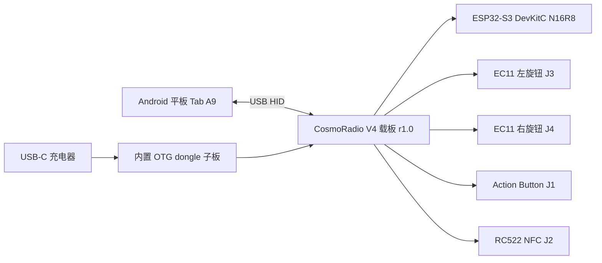

# CosmoRadio V4 PCB

> **状态（2026-05-22）**：**r1.0 已打样 + 实焊 + 双板并排固件验证通过**。这是 V4 技术验证交付的 PCB 终版。
>
> **设计源文件唯一权威**：[`cosmoradio-v4-jlceda/`](cosmoradio-v4-jlceda/)（嘉立创EDA专业版手绘）。
> 仓库历史里出现过的 KiCad `cosmoradio-v4-carrier/`（Plan v2，circuit-synth + pcbnew 自动布线备选）**从未打样、未使用，已删除**——如需追溯见 git 历史。

CosmoRadio V4 的 PCB 是一块 **ESP32-S3 DevKitC N16R8 载板（carrier board）**，用于技术方案验证和单套原型制作。目标不是量产最优，而是：可快速打样、可手工装配、可稳定验证 USB HID + 外部充电 + 旋钮 + 按钮 + NFC、出问题易测量返修。

---

## 设计源文件与制造产物

| 文件 | 内容 | 状态 |
|------|------|------|
| [`cosmoradio-v4-jlceda/cosmoradio-v4-r1.0.epro2`](cosmoradio-v4-jlceda/) | 嘉立创EDA专业版可移植工程（原理图 + PCB） | ✅ 验证版唯一真源 |
| [`cosmoradio-v4-jlceda/cosmoradio-v4-r1.0-schematic.png`](cosmoradio-v4-jlceda/) | 原理图渲染（从工程导出） | ✅ |
| `cosmoradio-v4-jlceda/manufacturing/` | Gerber / 钻孔 / 坐标 / BOM / 原理图 PDF / STEP / DXF | ✅ 已导出归档 |

### 从嘉立创EDA专业版导出制造文件（清单）

> 制造文件无法从 `.epro2` 的 JSON 直接生成，必须在嘉立创EDA专业版 GUI 里导出（参 [官方文档](https://prodocs.lceda.cn/cn/pcb/export-pcb-fabrication-file-gerber/)）。
> 当前 r1.0 导出文件已归档到 `manufacturing/`。如需重新导出，用 v3.2.135+ 打开 `cosmoradio-v4-r1.0.epro2` 后，逐项导出到 `manufacturing/`：

| # | 产物 | 菜单路径 | 备注 |
|---|------|----------|------|
| 1 | **Gerber + 钻孔** | `文件 → 导出 → PCB制板文件（Gerber）` | 输出一个 zip（.GTL/.GBL/.DRL…），即 JLCPCB 上板包 |
| 2 | **坐标文件**（贴片） | `导出 → 坐标文件` | SMT 用；本板被动件少，仅 8× 0805 |
| 3 | **BOM** | `导出 → BOM` | 物料清单 |
| 4 | **原理图 PDF** | `原理图编辑器 → 导出 → PDF/图片` | |
| 5 | **PCB PDF / 图片** | `PCB编辑器 → 导出 → PDF/图片` | 含丝印/阻焊层，便于核对 |
| 6 | **3D STEP** | `PCB编辑器 → 导出 → 3D文件` | 给结构设计对位用 |
| 7 | **板框 DXF** | `文件 → 导出 → DXF` | 给结构设计对位用 |

> 上板前用嘉立创 DFM 工具或 Gerber 查看器复核一遍再下单。导出完成后把文件放进 `manufacturing/`，我来核对归档。

---

## 当前范围

| 项目 | 结论 |
|------|------|
| 合作状态 | 2026-04-29 与 Arthur 重启 V4 |
| 当前交付 | 技术方案验证 + 单套原型制作 |
| 合同价 | ¥5,000 |
| 核心风险 | PCB 设计与验证（已通过） |
| 非当前目标 | 原 4 套整机 + 8 套电子件批量交付 |

## 验证里程碑

**2026-05-07 整体方案验证完成 ✅**——电气、固件、NFC 协议在万能板飞线版上端到端跑通，所有方案级未知收敛。

| 项目 | 状态 |
|------|------|
| NFC 数量 | ✅ 1 个 RC522 mini |
| 一分二 OTG + 充电线材 | ✅ 多型号实测，选定 YK16-09E V1 作内置子板基准 |
| 手工万能板原型 | ✅ 已焊（[图片](../docs/assets/v4-handmade-prototype-2026-05-06.jpg)） |
| GPIO 分配 | ✅ V4 终版定稿，权威表见 [CLAUDE.md](../CLAUDE.md) |
| RC522 NFC 驱动 | ✅ 1MHz SPI + NDEF Text Record 解析 |
| HID 协议 | ✅ NDEF payload 主路径 + `NFC:<UID>` 兜底 |
| 端到端验证 | ✅ iPhone 写卡 → ESP32 读 NDEF → HID 键入 |

**2026-05-22 PCB r1.0 实焊验证完成 ✅**

- ✅ 嘉立创EDA手绘原理图 → 打样 → 焊接 → DevKitC 插入 → JST 端子线压接
- ✅ 双 EC11 + Action Button + NFC + USB HID 全链路验证通过（两台板子并排测）
- ⚠ **已知 r1.0 issue**：J4 (EC11-R) 引脚顺序画成跟 J3 镜像，物理 EC11 端子线序错位。**固件已 walkaround**（`main/input_handler.c` 重指派 `GPIO_ENC2_A/B/SW` + swap A↔B，见 [CLAUDE.md "PCB r1.0 EC11-R 接线 walkaround"](../CLAUDE.md)），硬件无需返工。
- ⚠ 原理图里 H-L pin1 / H-R pin1·pin2 的 GND/+5V 标签标错；r1.0 因走线没真连而幸免，r1.1 应改正。
- ⏳ 待新 Tab A9 到货后补整机长时间热稳定 + 2h 充电链路回归（当前在安卓手机上验证）。

## 板子定位

ESP32-S3 DevKitC 通过 2.54mm 排母插在载板上（不焊死，易更换），载板只负责固定主控与外设线束、消灭 V3 的飞线、把旋钮/按钮/NFC/USB 标准化、提供必要的上拉/RC 去抖。



## 接口定义（r1.0）

权威 GPIO → net 映射见 [CLAUDE.md "GPIO Pin Assignments"](../CLAUDE.md)。下表为 PCB 视角的连接器物理接线：

| Ref | 接口 | 类型 | 连接对象 | 信号（按 pin 顺序）|
|-----|------|------|----------|------|
| H-L | DevKitC 左列 socket | 1×22P 排母 2.54mm | DevKitC 左侧排针 | 含 GPIO19/20 + EC11-L + BTN |
| H-R | DevKitC 右列 socket | 1×22P 排母 2.54mm | DevKitC 右侧排针 | 含 EC11-R + NFC SPI |
| J1 | BTN | XH2.54 2P | Kailh BOX 按钮 | pin1=SIG, pin2=GND |
| J2 | NFC | XH2.54 8P | RC522 mini | CS, SCK, MOSI, MISO, IRQ, GND, RST, VCC |
| J3 | EC11-L（用户左旋钮） | XH2.54 5P | 左旋钮 | pin1-5 = A, GND, B, GND, SW |
| J4 | EC11-R（用户右旋钮） | XH2.54 5P | 右旋钮 | pin1-5 = SW, GND, B, GND, A ⚠ 跟 J3 镜像，r1.1 改对称 |
| J5 | OTG USB 数据 | XH2.54 4P | OTG dongle 拆 USB-A 后 4 飞线 | pin1-4 = VBUS, D-, D+, GND |

> H-L 中心距 H-R = **22.86mm**（= 9 × 2.54mm pitch），breadboard 兼容，以飞线万能板实测为准。

## 原理图元件清单（r1.0，14 元件 + 4 螺柱位）

| Ref | 元件 | 封装 | 说明 |
|-----|------|------|------|
| H-L, H-R | 1×22P 排母座 (×2) | 2.54mm THT | DevKitC 插入 |
| J1 | XH2.54 2P 立式直针座 | THT | Action Button |
| J2 | XH2.54 8P 立式直针座 | THT | RC522 NFC |
| J3, J4 | XH2.54 5P 立式直针座 (×2) | THT | EC11 旋钮 |
| J5 | XH2.54 4P 立式直针座 | THT | OTG dongle USB 数据 |
| R1-R4 | 10kΩ 上拉（EC11 A/B） | 0805 | LCSC C17414 |
| C1-C4 | 10nF 对 GND（EC11 A/B） | 0805 X7R 50V | RC 去抖，τ=100µs |
| U1-U4 | M2.5 固定螺柱位 | 通孔 | 四角 |

**相对旧 spec 取消的元件**：USB-C 母座（充电改走 OTG dongle 内部）、USB-C CC 5.1k Rd ×4、SS34 防倒灌、外接 WS2812B + 330Ω（LED 改用 DevKitC GPIO48 板载 RGB）。

## PCB 物理约束

| 项目 | 值 |
|------|------|
| 尺寸 | **100mm × 100mm**（JLC 免费打样上限）|
| 层数 / 板厚 / 铜厚 | 2 层 / 1.6mm / 1oz |
| 表面 / 阻焊 / 丝印 | HASL 无铅 / 黑油 / 白字 |
| 安装孔 | 4 × M2.5（四角，孔径 2.7mm）|
| 制造 | JLCPCB 5 片打样 |
| 装配 | 不上 SMT；纯打板，8× 0805 + 6 个连接器手焊 ~15min |

连接器物理位置（用户俯视）：**顶部** J5；**左侧** J1（靠前）/ J3（中段）；**右侧** J4（中段）/ J2（底部）。顶丝印有 **"OTG USB-C: DO NOT PLUG"** 警示——GPIO19/20 同时连到 J5 和 DevKitC native USB-C 焊盘，运行时插板载 OTG USB-C 会跟 dongle 注入冲突；烧录走 DevKitC **UART** USB-C。

---

## 关键设计判断（决策记录）

### 混合焊接：低风险小器件贴片，高机械应力器件直插

| 类型 | 方案 | 理由 |
|------|------|------|
| 电阻 / 电容 | 0805 SMD | 适合加热台，布线短，易返修 |
| JST-XH 连接器 | 直插件 | 插拔受力大，原型更可靠 |
| DevKitC 排母 | 直插件 | 承重和插拔受力，不适合贴片 |

比全直插件整洁，比全贴片更适合单套原型。

### NFC 连接器按 8P 处理

以 RC522 mini 实物丝印为准：`CS, SCK, MOSI, MISO, IRQ, GND, RST, 3V3`（8P）。IRQ 第一版接出但固件未用，避免后续想做中断驱动时改板。

### EC11 A/B 加 RC 去抖

A/B 信号各加 10kΩ 上拉 + 10nF 对地（τ=100µs），既增强边沿陡度又抑制机械抖动——解决飞线版上"一格不准、内部上拉不够脆"的问题。SW 仅靠内部上拉。

### USB / 充电：选定"拆解成品 OTG dongle 内置"而非自研 PD 子板

核心约束：Tab A9 必须同时是 **Data Host**（host ESP32）+ **Power Sink**（被外部充电）——这不是 USB-C 默认角色组合，需要角色拆分。

- ✅ **成品一分二 OTG + 充电线材**已实测让 Tab A9/Android 同时 HID 输入 + 充电 → 证明设备支持该状态。V4 选定拆解 YK16-09E V1、取内部 PCB 内置（J5 4 飞线）。
- ❌ **被动 SS34 + 6P 转接板注入 VBUS**（2026-04-30 实测失败）：即使配 5.1k Rd，也只能让平板识别 OTG 设备，无法完成 Type-C/PD 角色协商进入充电态。已降级为失败路径记录，不再作为主线。
- ⏸ **自研 LDR6028/LDR6023C PD charge-through 子板**：技术可行但价值在形态可控而非降成本（不比 ¥20 级成品线材便宜，且有协议调试风险）。后续方案，不塞进第一版。
- ❌ **BLE HID + USB-C 只充电**：BLE HID 实测不稳定且违反"必须有线 HID"硬约束，排除。

> 深度调研见 [`research/Tab_A9_OTG_Charging_Feasibility_Report.md`](research/Tab_A9_OTG_Charging_Feasibility_Report.md)（2026-04-30 Manus 调研，针对半主动方案偏负面；后续实测一分二线材修正了"设备能力"判断，但确认被动复刻不够）。

---

## r1.1 路线（未启动，post-delivery）

r1.0 已满足 V4 技术验证交付。若后续迭代，r1.1 应：

1. 把 J4 (EC11-R) 引脚顺序改回跟 J3 对称的 `[A, GND, B, GND, SW]`，去掉固件 `input_handler.c` 里的 EC11-R walkaround。
2. 修正原理图里 H-L pin1 / H-R pin1·pin2 的 GND/+5V 误标。
3. 尝试把 NFC SPI 时钟从 1MHz 拉回 5MHz（铜箔走线 + 去耦后应可稳定，飞线版受 RF 噪声限制）。
4. 整机长时间热稳定 + 2h 充电链路回归（需新 Tab A9）。

## 目录

```
pcb/
├── README.md                          # 本文件
├── cosmoradio-v4-jlceda/              # ✅ r1.0 验证版唯一真源
│   ├── cosmoradio-v4-r1.0.epro2       #   嘉立创EDA可移植工程
│   ├── cosmoradio-v4-r1.0-schematic.png
│   └── manufacturing/                 #   Gerber/BOM/坐标/PDF/STEP/DXF
├── asset/                             # 飞线测试版照片 + DevKitC 引脚图
└── research/                          # Tab A9 OTG 充电可行性调研
```
