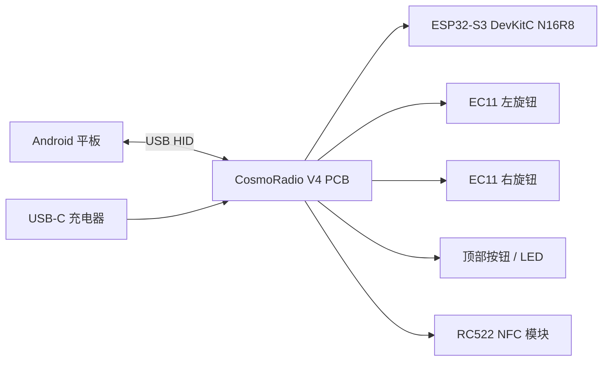
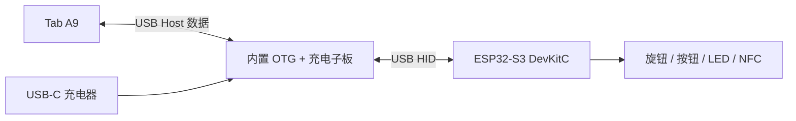
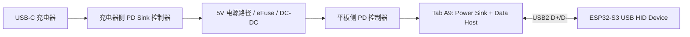
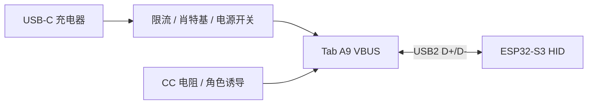
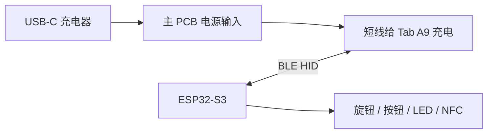
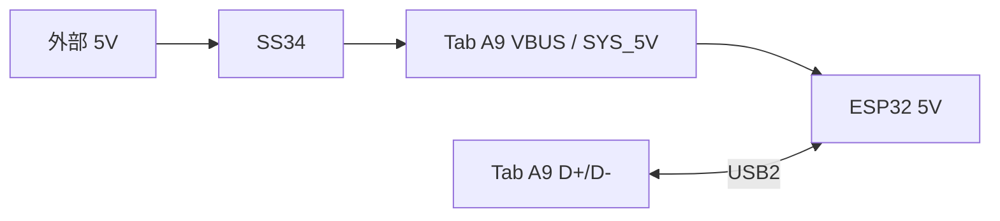
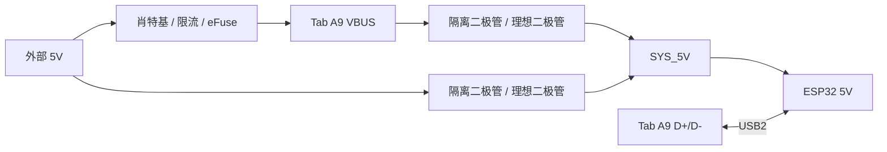

# CosmoRadio V4 PCB

CosmoRadio V4 的 PCB 目标是做一块 ESP32-S3 DevKitC N16R8 载板，用于技术方案验证和单套原型制作。

当前阶段不追求量产最优，而是追求：

- 可快速打样
- 可手工装配
- 可稳定验证 USB HID、外部充电、旋钮、按钮、NFC
- 出问题时容易测量和返修

## 当前范围

| 项目 | 结论 |
|------|------|
| 合作状态 | 2026-04-29 与 Arthur 重启 V4 |
| 当前交付 | 技术方案验证 + 单套原型制作 |
| 合同价 | ¥5,000 |
| 目标时间 | 2026-05-20 左右 |
| 核心风险 | PCB 设计与验证 |
| 非当前目标 | 原 4 套整机 + 8 套电子件批量交付 |

## 板子定位

这不是完整 ESP32 主控板，而是 **ESP32-S3 DevKitC N16R8 carrier board**。

ESP32-S3 DevKitC 通过 2.54mm 排母插在 PCB 上，PCB 只负责：

- 固定主控与外设线束
- 消灭 V3 的万能板和飞线
- 将旋钮、按钮、LED、NFC、USB-C 接口标准化
- 提供必要的上拉、电阻、二极管、去耦
- 支持单套原型的调试和返修

## 已确认事实

### 主控

- 使用 ESP32-S3 DevKitC N16R8，不再使用 V3 的 ESP32-S3 SuperMini。
- DevKitC 插在载板上，不直接焊死。
- ESP32-S3 原生 USB OTG 固定使用 GPIO19 / GPIO20。
- 当前固件仍是 V3/SuperMini pinout，后续必须迁移到 V4 pinout。

### 输入与输出

- 两个 EC11 旋钮，每个旋钮有 A / B / SW。
- Action Button 使用 Kailh BOX 轴 + 6.25U 卫星轴，本质是单路低电平按钮。
- LED 使用 WS2812B，数据线串 330R。
- NFC 使用 RC522 mini 模块，通过 SPI 连接，不把 MFRC522 芯片集成到主板。

### USB 与供电

- 平板是 Samsung Galaxy Tab A9 8.7"。
- 平板侧需要同时承担 USB Host 和充电需求。
- HID 必须走有线 USB；BLE HID 之前已经测试过，不稳定，排除出当前主路径。
- 市面上容易买到的是 OTG + 充电转接线/小扩展坞，不是适合直接嵌入产品的裸模块。
- 长线成品只能作为电气验证工具，不能作为最终产品形态。
- 当前正式目标改为：把 OTG + 充电子系统内置化，减少外露线材。

第一版 USB/充电路径分三档处理：

| 档位 | 方案 | 当前定位 |
|------|------|----------|
| P0 | 外购 OTG + 充电转接器整件 | 验证 Tab A9 是否支持 HID + 充电同时工作 |
| P1 | 拆解转接器，取内部 PCB，短线/板内固定 | 当前最现实的产品化方向 |
| P2 | 自研 USB-C OTG + PD 子板 | 后续方案，不塞进第一版主板风险内 |

被动 VBUS 注入方案降级为实验项：

- J6 充电输入 USB-C
- J5 平板输出 USB-C
- J6 VBUS 通过 SS34 注入 J5 VBUS
- J5 / J6 CC1 和 CC2 视转接板实测情况配置 5.1k Rd

原因：它依赖 Tab A9 在 Host 模式下仍接受外部 VBUS，不能作为最稳妥主路径。

不能把 CH224K、HUSB238 这类 PD Sink/诱骗芯片当成完整解法。它们主要解决“从充电器取电压”，不负责让平板同时保持数据 Host 和供电 Sink，也不负责完整 USB 数据/供电角色编排。

### USB/充电可选方案重审

问题本质：Tab A9 必须同时处于 **Data Host** 和 **Power Sink**。这不是普通 USB-C 默认角色，默认情况下 Host 往往也是供电 Source。要让平板一边 Host ESP32，一边被外部充电，需要角色拆分。

| 方案 | 是否能集成到主 PCB | 风险 | 结论 |
|------|-------------------|------|------|
| 标准 USB-C PD charge-through | 能 | 高 | 正规方案，但不适合作为第一版主线 |
| 平板特定的被动/半主动 OTG 充电 | 能 | 中高 | 便宜，可试，但依赖 Tab A9 实测 |
| 拆解成品转接器并内置小板 | 不能算真正集成 | 低中 | 只能验证和救急，不是最终交付形态 |
| BLE HID + USB-C 只负责充电 | 能 | 低 | 已排除：BLE HID 实测不稳定，且当前要求必须有线 HID |

当前主路径只保留两个有线方案：

1. 标准 USB-C PD charge-through：正规，可交付，但研发风险和调试成本最高。
2. Tab A9 专用半主动 OTG 充电：可低成本集成，但必须先实测证明 Tab A9 接受这种行为。

标准 PD charge-through 架构如下：

这种方案需要：

- 平板侧 Type-C/PD 控制器：处理 Power Role Swap / Data Role Swap，使 Tab A9 保持 Host，同时从本设备受电。
- 充电器侧 PD Sink 控制器：从外部充电器取电。
- 电源路径保护：eFuse、限流、反灌保护、ESD、VBUS 放电。
- USB2 D+ / D- 路由：只有 ESP32 一个 USB 设备时不一定需要 USB Hub；若未来还有多个 USB 设备，才需要 Hub。
- PD 控制器配置或固件：这是主要工程风险。

低成本经验方案如下：

这种方案可以直接画在 PCB 上，成本低，但不是标准解法。它是否可用只取决于 Tab A9 的实际行为。若选它，必须先做洞洞板/小样验证：

1. Tab A9 能稳定枚举 ESP32 HID。
2. 插入充电器后 HID 不断连。
3. 系统显示充电，电池电量能净增加。
4. VBUS 无反灌，ESP32 和转接区无明显温升。
5. 熄屏、亮屏、重插、开机后均能恢复。

已排除方案：BLE HID + USB-C 只负责充电：

这个方案硬件上最容易集成到主 PCB：USB-C 只做供电，输入端可以用 PD Sink/诱骗芯片，输出端按 Type-C Source 给平板 5V。数据改为 BLE HID。但它违反当前硬约束，且 BLE HID 已实测不稳定，因此不作为 V4 路线。

### 有线 HID 下的当前建议

先做 **Tab A9 半主动 OTG 充电小样**，不要直接把标准 PD charge-through 塞进第一版主 PCB。

2026-04-30 Manus 调研结论见 [Tab_A9_OTG_Charging_Feasibility_Report.md](research/Tab_A9_OTG_Charging_Feasibility_Report.md)。结论偏负面：Tab A9 SM-X110 的半主动方案成功率较低，但验证成本低，仍值得做一次小样排雷。

原因：

- 标准 PD charge-through 是正确方向，但需要 PD 控制器配置、PD 协议调试、电源路径保护和可能的协议分析仪。
- V4 当前是技术验证 + 单套原型，合同价 ¥5,000，不能把主要预算压在 USB-C PD 协议栈调试上。
- 如果 Tab A9 接受半主动方案，主 PCB 能低成本集成。
- 如果 Tab A9 不接受半主动方案，再决定是否升级到标准 PD charge-through，或者重新评估产品成本。
- LAVA 兼容性资料没有把基础版 Tab A9 SM-X110 列为明确支持设备；社区反馈也没有形成可靠正例。

半主动小样必须验证：

| 验证项 | 通过标准 |
|--------|----------|
| HID 枚举 | Tab A9 能识别 ESP32-S3 TinyUSB HID |
| 充电接入 | 插入外部充电器后 HID 不断连 |
| 电池状态 | Android 显示充电，且电量能净增加 |
| 反灌 | 充电器拔出/插入时没有异常回灌 |
| 热稳定 | 连续运行 2 小时无明显温升 |
| 恢复能力 | 平板重启、熄屏、亮屏、重插后能恢复 |

第一版验证可分两档。用现有 SS34 即可，不需要另买“理想二极管”模块。

最小验证拓扑只需要 1 颗 SS34：

这个拓扑里 `Tab_A9_VBUS` 和 `SYS_5V` 是同一个节点。不插外部电源时，平板作为 USB Host 给 ESP32 供电；插外部电源时，外部 5V 通过 SS34 尝试注入同一节点。SS34 的作用是防止平板 VBUS 反灌到外部充电器输入。

更完整的诊断拓扑包含 `SYS_5V` 电源 OR-ing，需要 3 颗 SS34：

原因：不插外部电源时，平板作为 USB Host 必须能从 `Tab_A9_VBUS` 给 ESP32 供电。若 ESP32 只接外部 `VBUS_IN`，则无法验证正常 OTG 使用场景。外部电源接入后，`VBUS_IN` 同时给 ESP32 供电，并通过隔离/限流路径尝试注入 `Tab_A9_VBUS` 给平板充电。

SS34 接线方向：电流从无色端流向有色条纹端，条纹端是阴极。`外部 5V -> Tab_A9_VBUS` 时，条纹端朝 `Tab_A9_VBUS`。

## 关键设计判断

### 采用混合焊接方案

第一版不做全直插件，也不做全贴片。

| 类型 | 方案 | 理由 |
|------|------|------|
| 电阻 | 0805 SMD | 适合加热台，易夹取，易返修 |
| 电容 | 0805 SMD | 适合加热台，布线短 |
| SS34 | SMA / DO-214AC SMD | 电流能力够，焊盘大，可返修 |
| JST-XH 连接器 | 直插件 | 插拔受力大，原型更可靠 |
| DevKitC 排母 | 直插件 | 承重和插拔受力，不适合贴片 |
| USB-C | DIP 转接板 / 2.54mm 排孔 | 第一版避免裸 USB-C SMT 焊接风险 |

判断：**低风险小器件贴片，高机械应力器件直插件**。这比全直插件更整洁，也比全贴片更适合单套原型。

### 不把 USB-C 母座直接做成 SMT 主件

裸 USB-C SMT 母座对第一版不划算：

- 焊盘密，短路排查成本高
- 插拔受力大，需要外壳和板边机械支撑
- 3D 模型和 footprint 容易踩坑
- D+ / D- / CC 任何问题都会让 USB 调试变复杂

第一版主板使用已有 6P USB-C DIP 转接板更稳。OTG + 充电子系统如果采用拆板方案，则作为独立子板固定，不把未知小板强行复刻进主 PCB。

### 先解决线材形态，不先挑战 USB-C 协议

当前真正问题不是“有没有转接器”，而是“转接器线太长、外露、丑”。因此第一轮验证目标应改成：

1. 买 3-5 个便宜 OTG + 充电转接器。
2. 逐个验证 Tab A9 + ESP32-S3 HID + 充电是否稳定。
3. 拆开最稳定的一款，记录内部 PCB 尺寸、接口、焊点、芯片丝印。
4. 将其作为内置子板固定在外壳内，用短线或板内焊点连接主板。
5. 主 PCB 只为它预留 USB HID 接口、5V/GND 测试点、安装空间和应力释放结构。

这个路线比从零设计 USB-C PD/OTG 子板更快，也比把完整转接线塞进外壳更干净。

### NFC 连接器按 8P 处理

文档里曾出现 7P / 8P 不一致。以 RC522 mini 实物和 NFC 文档为准，采用 8P：

| Pin | RC522 丝印 | 信号 |
|-----|------------|------|
| 1 | SDA | CS |
| 2 | SCK | SCK |
| 3 | MOSI | MOSI |
| 4 | MISO | MISO |
| 5 | IRQ | IRQ |
| 6 | GND | GND |
| 7 | RET | RST |
| 8 | 3V3 | 3V3 |

IRQ 可选，但第一版建议接出，避免后续想做中断驱动时改板。

### 顶部按钮和 LED 暂时分开连接

PCB Spec 曾建议将按钮和 LED 合并为 4P 顶部模块连接器。BOM 里按钮和 LED 是分开的 2P + 3P。

第一版建议分开：

- BTN：2P XH2.54
- LED：3P XH2.54

理由：

- 原型更容易测试
- 按钮和 LED 可独立替换
- 顶部模块结构未最终定型，分开线束更灵活

## 初版接口草案

| Ref | 接口 | 类型 | 连接对象 | 信号 |
|-----|------|------|----------|------|
| U1 | DevKitC Socket | 2×22P 排母 | ESP32-S3 DevKitC N16R8 | GPIO / 5V / 3V3 / GND / USB |
| J1 | EC11-L | XH2.54 5P | 左旋钮 | 3V3, GND, A, B, SW |
| J2 | EC11-R | XH2.54 5P | 右旋钮 | 3V3, GND, A, B, SW |
| J3 | BTN | XH2.54 2P | Kailh 按钮 | SIG, GND |
| J4 | LED | XH2.54 3P | WS2812B | 3V3, GND, DIN |
| J5 | NFC | XH2.54 8P | RC522 mini | SDA, SCK, MOSI, MISO, IRQ, GND, RST, 3V3 |
| J6 | USB-HID-OUT | USB-C DIP 6P / 焊盘 | 内置 OTG + 充电子板数据口 | VBUS, GND, D-, D+ |
| J7 | USB-PASSIVE-TEST | 可选 USB-C DIP 6P | 被动注入实验 | VBUS, GND, CC1, CC2, D-, D+ |
| M1 | OTG-CHARGE-MODULE | 安装区 / 焊盘 | 拆解后的 OTG + 充电小板 | 待实测定义 |

## V4 GPIO 草案

| 功能 | GPIO | 备注 |
|------|------|------|
| EC11-L A | GPIO1 | 外部 10k 上拉 |
| EC11-L B | GPIO2 | 外部 10k 上拉 |
| EC11-L SW | GPIO3 | 按下接 GND |
| EC11-R A | GPIO4 | 外部 10k 上拉 |
| EC11-R B | GPIO5 | 外部 10k 上拉 |
| EC11-R SW | GPIO6 | 按下接 GND |
| Action Button | GPIO7 | 按下接 GND |
| WS2812B DIN | GPIO8 | 串 330R |
| RC522 RST | GPIO9 | 低有效 |
| RC522 IRQ | GPIO10 | 可选 |
| USB D- | GPIO19 | ESP32-S3 原生 USB |
| USB D+ | GPIO20 | ESP32-S3 原生 USB |
| RC522 CS | GPIO34 | FSPI |
| RC522 MOSI | GPIO35 | FSPI |
| RC522 SCK | GPIO36 | FSPI |
| RC522 MISO | GPIO37 | FSPI |

## 原理图元件草案

| Ref | 元件 | 封装建议 | 说明 |
|-----|------|----------|------|
| R1-R4 | 5.1k | 0805 | USB-C CC Rd，按实际转接板配置 DNP/焊接 |
| R5-R8 | 10k | 0805 | EC11 A/B 外部上拉 |
| R9 | 330R | 0805 | WS2812B DIN 串联 |
| D1 | SS34 | SMA / DO-214AC | 仅用于被动注入实验 |
| C1 | 100nF | 0805 | NFC 3V3 去耦 |

## PCB 物理约束

| 项目 | 目标 |
|------|------|
| 尺寸 | 80mm × 50mm 初版 |
| 层数 | 2 层 |
| 板厚 | 1.6mm |
| 铜厚 | 1oz |
| 阻焊 | 黑色 |
| 丝印 | 白色 |
| 安装孔 | 4 × M2.5 |
| 制造 | JLCPCB 5 片打样 |

## 布局原则

- DevKitC 放中间，保证 USB、JST、排母都有手工操作空间。
- EC11-L / EC11-R 分别靠左右边，线束自然走向两侧。
- NFC 连接器靠近顶部模块线束方向，SPI 线尽量短。
- USB-HID-OUT 和内置 OTG + 充电子板安装区靠近外壳开孔，减少线长。
- VBUS 走线宽度至少 1mm。
- USB D+ / D- 手工布线，短、并行、少过孔。
- 每个连接器旁边必须有清晰丝印：接口名 + pin 功能。
- 预留测试点：5V、3V3、GND、D+、D-、NFC CS/SCK/MOSI/MISO。

## 开放问题

1. DevKitC N16R8 实物 pinout 和 2×22 排母间距必须核对。
2. USB-C DIP 转接板 6P 的实际孔距、板宽、安装孔需要实测。
3. 需要购买并拆解 3-5 个 OTG + 充电转接器，选择可内置的小 PCB。
4. NFC 最终数量是 1 个还是 2 个；第一版建议 1 个。
5. 顶部模块线束是否最终合并为单根 5P/6P，还是保持 BTN 2P + LED 3P。
6. 80mm × 50mm 是否与 Arthur 的底部安装空间和螺丝柱位置匹配。
7. 是否需要给第二版预留扩展接口，例如 I2C / UART / extra GPIO。

## 下一步

1. 实测 DevKitC N16R8 排针尺寸和 pinout。
2. 买 3-5 个 OTG + 充电转接器，先验证 Tab A9 同时 HID + 充电。
3. 拆解最稳定的转接器，记录内部 PCB 尺寸、芯片丝印、焊点定义。
4. 实测 USB-C DIP 转接板尺寸。
5. 确认第一版连接器口径：BTN/LED 分开，NFC 8P。
6. 画 KiCad 原理图。
7. 生成 80mm × 50mm 初版 PCB layout。
8. 优先手工检查 USB D+ / D-、VBUS 和内置子板安装空间。
